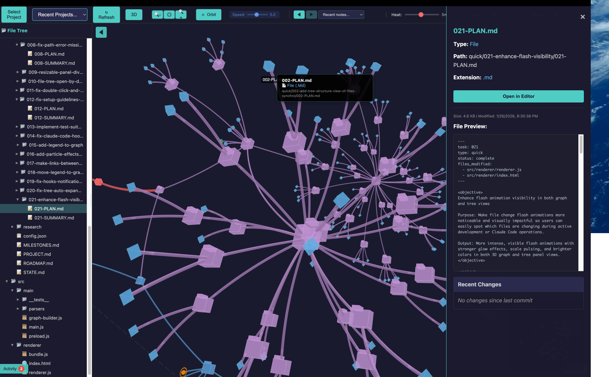

.

# GSD Viewer

A desktop application that visualizes [GSD](https://github.com/glittercowboy/get-shit-done) project structure as an interactive 3D force-directed graph. Fly through your project's phases, plans, tasks, requirements, and files — seeing relationships, progress, and blockers at a glance.


## Features

### 3D Visualization
- Force-directed graph powered by [3d-force-graph](https://github.com/vasturiano/3d-force-graph)
- Color-coded nodes by type (phases, plans, tasks, requirements, files)
- Different shapes: octahedron (planning), icosahedron (source), hexagonal cylinder (commits)
- Node sizing based on connection count
- Progress coloring (green=complete, yellow=in-progress, gray=pending)
- 2D/3D toggle for different viewing modes

### Real-time Activity
- Live file watching with flash animations on changes
- Particle burst effects on file modifications
- Heat map visualization for recently changed files
- Activity trails connecting changed files
- Activity feed with scrolling change log
- Git integration (staged, modified, untracked indicators)

### Claude Code Integration
- PostToolUse hooks detect Read/Write/Edit operations
- Read operations display distinct blue flash (not possible with file watchers alone)
- Enhanced flash visibility (1.5x default intensity, 2.5x scale pulse)
- Animation batching for smooth 60fps during rapid operations
- Debug mode for troubleshooting hook configuration

### Navigation
- Click node to zoom/focus camera
- Bookmarks with keyboard shortcuts (Ctrl/Cmd+1-9 to save, 1-9 to jump)
- Back/forward navigation history (Alt+Left/Right)
- Breadcrumb trail for hierarchy navigation
- Minimap with click-to-navigate and drag support
- Follow-active mode tracks file changes
- Orbit mode for presentations
- Path playback through all nodes

### File Inspector
- Double-click to open file inspector modal
- Diff editor with git/session comparison
- Structure tree for code navigation (functions, classes, imports)
- File metadata and quick actions (Open in Editor, Copy Path, Copy Content)
- In-file search with highlighting (Ctrl/Cmd+F)

### Tree Panel
- Collapsible file tree synchronized with graph
- Auto-expands to reveal flashing files
- Click to focus, double-click to inspect
- Resizable panel divider

### Diagram View
- Pipeline visualization of GSD workflow stages
- Artifact cards with status indicators
- Flash animations synced with graph view
- Selection sync between diagram and graph

### Live Activity Intelligence (v1.6)
- **Dashboard View** - Current operation indicator, session stats, sparkline, pie chart
- **File Heatmap View** - Treemap visualization with activity heat, drill-down navigation
- **Operation Flow Timeline** - Swimlanes by file, pattern detection, playback controls
- **Context Window Meter** - Estimated usage tracking, files in context, at-risk warnings
- **Smart Notifications** - Toast alerts for file bursts, rapid activity patterns
- **Session Recording** - Record, playback, and export sessions as markdown

## Installation

```bash
# Clone the repository
git clone https://github.com/rafreid/gsdview.git
cd gsdview

# Install dependencies
npm install

# Start the application
npm start
```

## Usage

1. Launch the application
2. Click "Select Folder" and choose a directory containing a `.planning/` folder (GSD project)
3. Explore the 3D graph visualization
4. Click nodes to see details, double-click files to inspect

### Keyboard Shortcuts

| Shortcut | Action |
|----------|--------|
| `1-9` | Jump to bookmark |
| `Ctrl/Cmd + 1-9` | Save bookmark |
| `Alt + Left/Right` | Navigate back/forward |
| `P` | Toggle path playback |
| `Escape` | Close modal/panel |
| `Ctrl/Cmd + F` | Search in file inspector |

### Claude Code Hooks (Optional)

To enable real-time operation detection from Claude Code:

1. The app automatically configures hooks in `.claude/settings.json`
2. Hook script writes events to `.gsd-viewer/events/`
3. App watches for event files and triggers flash animations

If hooks aren't working, a notification appears after 30 seconds with a Setup Guide link.

## Configuration

Settings are persisted automatically:

| Setting | Range | Default | Description |
|---------|-------|---------|-------------|
| Flash Duration | 500ms - 5000ms | 2000ms | How long flash animations last |
| Flash Intensity | 50% - 200% | 100% | Brightness/scale of flash effects |
| Heat Decay | 30s - 10min | 5min | How long heat colors persist |
| Trail Duration | 10s - 5min | 60s | How long activity trails remain visible |
| Particle Effects | On/Off | On | Enable/disable particle bursts |

## Project Structure

```
gsdview/
├── src/
│   ├── main/
│   │   ├── main.js              # Electron main process
│   │   ├── preload.js           # IPC bridge
│   │   └── parsers/             # GSD document parsers
│   └── renderer/
│       ├── graph-renderer.js    # 3D graph visualization
│       ├── diagram-renderer.js  # Pipeline diagram view
│       ├── dashboard-renderer.js # Live dashboard view
│       ├── heatmap-renderer.js  # File heatmap view
│       ├── timeline-renderer.js # Operation timeline view
│       ├── view-controller.js   # View switching/lifecycle
│       ├── activity-dispatcher.js # Event routing
│       ├── notification-renderer.js # Smart notifications
│       ├── session-recorder.js  # Session recording/playback
│       └── index.html           # Application UI
├── .planning/                   # GSD planning documents
└── .gsd-viewer/                 # Runtime files (auto-generated)
    ├── hooks/                   # Claude hook script
    └── events/                  # Operation event files
```

## Tech Stack

- **Electron** - Desktop application framework
- **3d-force-graph** - 3D force-directed graph visualization
- **Three.js** - 3D rendering (via 3d-force-graph)
- **chokidar** - File system watching
- **electron-store** - Persistent settings
- **esbuild** - ES module bundling

## Development

```bash
# Start in development mode (with auto-rebuild)
npm start

# Build bundle only
npm run build

# Run tests
npm test

# Package for distribution
npm run package
```

## Milestones

| Version | Name | Status | Description |
|---------|------|--------|-------------|
| v1.0 | Initial Release | Shipped | 3D graph, GSD parsing, live watching |
| v1.1 | Real-time Activity | Shipped | Activity feed, heat map, git integration |
| v1.2 | File Deep Dive | Shipped | File inspector modal, diff editor |
| v1.3 | Enhanced Navigation | Shipped | Bookmarks, minimap, orbit mode |
| v1.4 | Live Activity Sync | Shipped | Claude hooks, enhanced flash effects |
| v1.5 | Diagram Pipeline View | Shipped | Workflow visualization, selection sync |
| v1.6 | Live Activity Intelligence | Shipped | Dashboard, heatmap, timeline, notifications, session recording |

**Quick Tasks Completed:** 24

See `.planning/MILESTONES.md` for detailed changelog.

## Troubleshooting

### Flash animations not visible
- Check Flash Intensity setting (increase if needed)
- Ensure the file tree panel is open for tree flashes
- For graph flashes, zoom in closer to the nodes

### Claude hooks not detected
- Click "Setup Guide" in the notification banner
- Verify `.claude/settings.json` contains the hook configuration
- Check that Claude Code is running in the same project directory
- Enable Debug mode to see incoming operations

### App performance issues
- Close other resource-intensive applications
- Reduce Flash Duration and Trail Duration settings
- Disable Particle Effects if running on older hardware

## Contributing

Contributions are welcome! Please:

1. Fork the repository
2. Create a feature branch (`git checkout -b feature/amazing-feature`)
3. Commit your changes (`git commit -m 'Add amazing feature'`)
4. Push to the branch (`git push origin feature/amazing-feature`)
5. Open a Pull Request

## License

MIT
